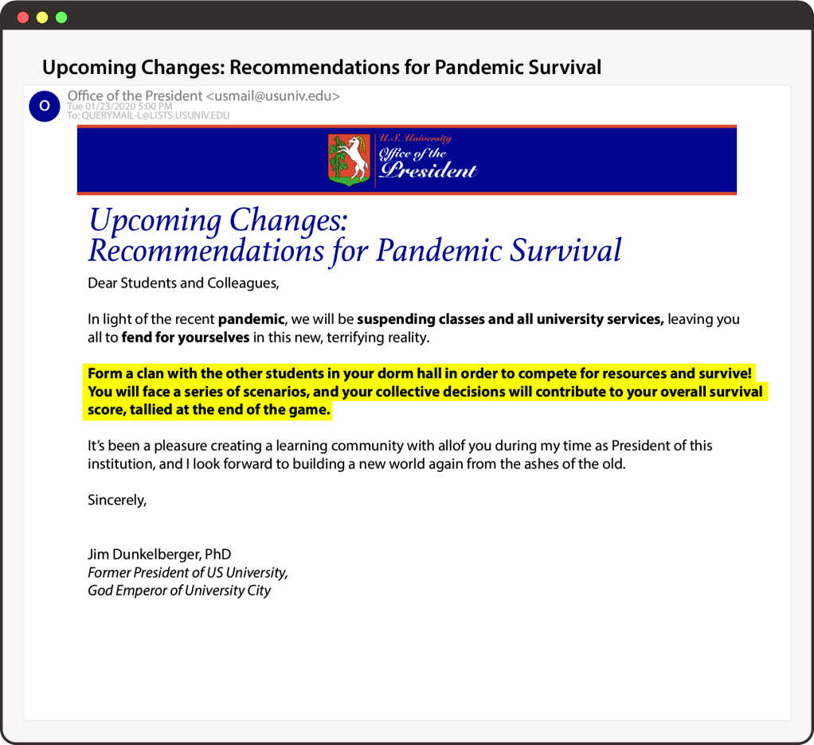

# Surviral with JANEbox Games

## Project Description
SurViral is a multiplayer, storyline game that allows players to work together and defeat a viral enemy to save the world! This project was built as part of the mintbean.io Multiplayer Game Hackathon to build a multiplayer, turn-based online game.

This is the client-side repo which uses web technologies to create the game (as opposed to game engines like Unity and Unreal Engine). We utilized React, React Router, Sass, and Socket.io to create the client-side functionality.

### Project Inspiration

We were inspired by story-centered games, like Life is Strange and the Stranger Things game series, as well as "Choose your own adventure" story/action games, like Pokemon and DnD. We were also inspired by social games like Jackbox Games and wanted collaboration to be an key aspect of the game. While the theme of the game is inspired by real-life events, we also wanted to ensure there was an inspirational and positive goal that all players were working towards.

## Project Links
* [Deployed Client](https://connietran-dev.github.io/janebox-surviral-client)
* [Deployed Server](https://surviral-server.herokuapp.com/)
* [Server Repo](https://github.com/connietran-dev/janebox-apocaly-server)

## Game Screenshots

Choose your player using socket.io to display players in the party:

Main game play:

University email:

## Future Goals

The prototype we have developed represents our minimum viable product. However, Surviral has a host of features that we hope to build as part of our future goals for the game, including:

* Having unique goals for each character based on the role the player selects at the beginning of the game
* Creating collaborative decisions on which the team must agree
* Having variable storylines and variable outcomes
* Exploring the concept of opposing teams and/or saboteurs (e.g., Secret Hitler, Werewolf) instead of one collaborative team 
* Incorporating a competitive aspect and creating minigames & puzzles

## Dependencies
* [NodeJS](https://nodejs.org/es/)
* [ReactJS](https://es.reactjs.org/)
  - [Create React App](https://github.com/facebook/create-react-app)
* [React Router](https://reactrouter.com/web/guides/quick-start)
* [node-sass](https://www.npmjs.com/package/node-sass)
* [Socket.IO Client](https://socket.io/docs/client-api/)
* [gh-pages](https://www.npmjs.com/package/gh-pages)

### Relevant Scripts
* `npm start` (runs dev mode @:3000)
* `npm run build` (builds app for production)
* `npm run deploy` (initiates `predeploy` to build then deploys to gh-pages)

### Deployment
See [Deploying a create-react-app with routing to GitHub pages](https://levelup.gitconnected.com/deploying-a-create-react-app-with-routing-to-github-pages-f386b6ce84c2) for more information.

## Wireframes

## Authors
* **Samantha Sexton**: Full stack web development, React, Sass, socket.io, wireframing - [@srsexton94](https://github.com/srsexton94)
* **Connie Tran**: Full stack web development, socket.io, Express, Node, React - [@connietran-dev](https://github.com/connietran-dev)
* **Nick Peter**: Special thanks to Nick to helped with story development